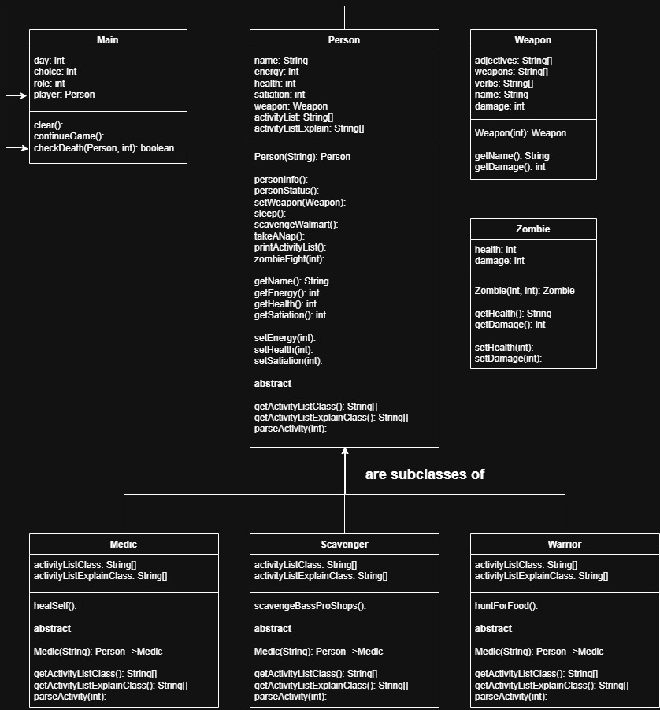

### Zombie Apocalypse
#### _67thStreetKids_

#### Description
This project allows users to experience their own survival journey in a zombie-infested world. Players can choose from multiple character roles—Scavenger, Medic, or Warrior—each with unique abilities and gameplay mechanics.

As the game progresses, users must search for weapons and resources to defend themselves during increasingly difficult waves of zombies. In addition to combat, players are responsible for managing their energy, health, and happiness levels to survive as long as possible.

This project combines strategy, resource management, and role-based gameplay to create an engaging survival experience.

#### Features:
* Multiple playable character classes with unique abilities
* Weapon selection system for combat and defense
* Zombie wave survival mechanics
* Player stat management (health, energy, satiation)
* Role-based gameplay encouraging strategic decisions

#### How the Code Works:
* The program uses separate classes for each character role (Scavenger, Medic, Warrior)
* Shared behaviors are implemented using inheritance
* Player stats and inventory are stored using arrays or ArrayLists
* Classes interact to manage combat, resource usage, and survival mechanics

#### How to Run the Program:
1. Compile all project files
2. Run the main class
3. Follow on-screen instructions to survive the apocalypse

#### Development Process:
Our team followed an Agile workflow by dividing responsibilities and collaborating through regular progress updates. We focused on creating a balanced survival system while ensuring each role felt unique. Future improvements would include expanded maps, more weapons, and advanced enemy behavior.

Team member roles:
* Cooper P
  * Project Manager
  * Programming Lead
* Hayden D
  * Quality Assurance Tester
* Krishan A
  * Technical Writer